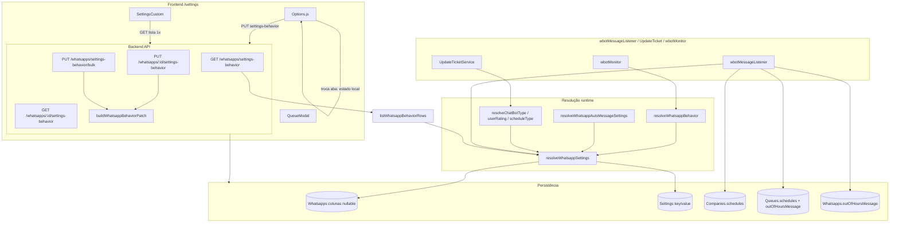
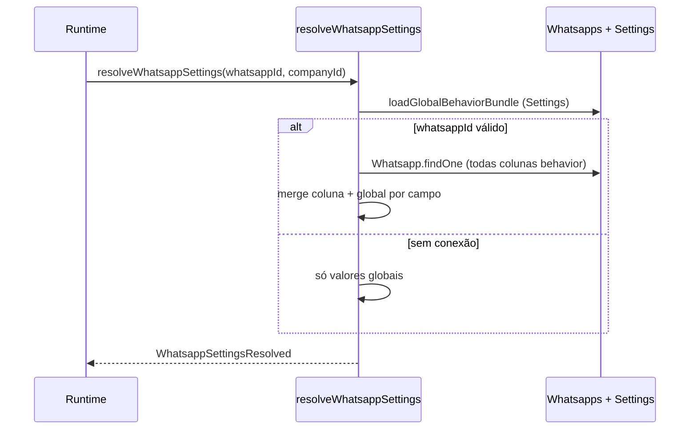

# Consolidação técnica — configuração por conexão WhatsApp

Documento de referência após as fases: chamadas/grupos, mensagens automáticas, `chatBotType`, `userRating`, `scheduleType` (modo expediente).

**Sem mudança de comportamento de atendimento** — apenas organização, API enriquecida (opcional) e observabilidade.

---

## Diagrama final (arquitetura)



---

## Tabela: campo → armazenamento → fallback → runtime

| Campo (efetivo) | Coluna `Whatsapps` | Fallback global (`Settings`) | Runtime principal |
|-----------------|-------------------|------------------------------|-------------------|
| `callHandlingMode` | `callHandlingMode` | `call` (enabled→accept, disabled→reject) | `wbotMonitor` → `resolveWhatsappBehavior` |
| `sendMessageOnCallReject` | `sendMessageOnCallReject` | `callRejectSendMessage` | `wbotMonitor` |
| `callRejectMessage` | `callRejectMessage` | `callRejectMessage` | `wbotMonitor` |
| `groupMessagesMode` | `groupMessagesMode` | `CheckMsgIsGroup` (enabled→ignore) | `wbotMessageListener` → `resolveWhatsappBehavior` |
| `sendGreetingAccepted` | `sendGreetingAccepted` | `sendGreetingAccepted` | `useAcceptTicket` + listener |
| `sendMsgTransfTicket` | `sendMsgTransfTicket` | `sendMsgTransfTicket` | `UpdateTicketService` |
| `sendGreetingMessageOneQueues` | `sendGreetingMessageOneQueues` | `sendGreetingMessageOneQueues` | `wbotMessageListener` |
| `chatBotType` | `chatBotType` | `chatBotType` | `wbotMessageListener` → `resolveChatBotType` |
| `userRating` | `userRating` | `userRating` | `UpdateTicketService` (fechamento) |
| `scheduleType` | `scheduleType` | `scheduleType` | `wbotMessageListener` → `resolveScheduleType` |

### Horários e mensagens fora de expediente (não por coluna behavior)

| Conceito | Armazenamento | Fallback | Runtime |
|----------|---------------|----------|---------|
| Grade empresa | `Companies.schedules` | — | `scheduleType` efetivo = `company` |
| Grade fila | `Queues.schedules` | — | `scheduleType` efetivo = `queue` |
| Mensagem fora (empresa) | `Whatsapps.outOfHoursMessage` | — | Modo `company` |
| Mensagem fora (fila) | `Queues.outOfHoursMessage` | — | Modo `queue` |

`null` na coluna WhatsApp → herda `Settings` da empresa para aquele campo.

---

## Fluxo de resolução por conexão



### API pública legada (mantida)

| Função | Implementação atual |
|--------|---------------------|
| `resolveWhatsappBehavior` | `resolveWhatsappSettings` → `.callsGroups` |
| `resolveWhatsappAutoMessageSettings` | `resolveWhatsappSettings` → `.autoMessages` |
| `resolveChatBotType` | `resolveWhatsappSettings` → `.chatBotType` |
| `resolveUserRating` | `resolveWhatsappSettings` → `.userRating` |
| `resolveScheduleType` | `resolveWhatsappSettings` → `.scheduleType` |

### API consolidada (nova, uso recomendado em código novo)

```typescript
import { resolveWhatsappSettings } from "../helpers/whatsappBehaviorSettings";

const settings = await resolveWhatsappSettings(ticket.whatsappId, companyId, "handleMessage");
// settings.callsGroups, settings.autoMessages, settings.chatBotType, ...
```

---

## 1. Centralização

**Antes:** cinco resolvers com lógica duplicada e até 2 queries (`Settings` + `Whatsapps`) por chamada.

**Agora:**

- `backend/src/helpers/resolveWhatsappSettings.ts` — núcleo de merge
- `backend/src/helpers/whatsappBehaviorSettings.ts` — exports legados + `listWhatsappBehaviorRows`
- `backend/src/helpers/whatsappBehaviorDebug.ts` — logs opcionais

**Próximo passo sugerido (sem urgência):** em `wbotMessageListener`, uma única chamada `resolveWhatsappSettings` por mensagem e repasse do objeto (reduz queries repetidas no mesmo handler).

---

## 2. Consistência GET `/whatsapps/settings-behavior`

Cada item da lista / `GET :id` retorna:

| Propriedade | Descrição |
|-------------|-----------|
| Valores efetivos | Ex.: `callHandlingMode`, `userRating`, `scheduleType` (já com fallback) |
| `usesPerConnection*` | Um flag por família (`Config`, `AutoMessages`, `ChatBotType`, `UserRating`, `ScheduleType`) |
| `columnValues` | **Novo** — valor bruto das colunas em `Whatsapps` (`null` = herda global) |

---

## 3. Validação PUT

Única porta de entrada para escrita behavior:

1. `assertBehaviorSettingsPayload` — chaves permitidas
2. `buildWhatsappBehaviorPatch` — tipos e valores

Usado em:

- `UpdateWhatsappBehaviorSettingsService`
- `BulkUpdateWhatsappBehaviorSettingsService`

`PUT /settings/:key` continua separado (config global legada, ex. `scheduleType` sem abas).

---

## 4. Frontend — `Options.js`

| Métrica | Valor |
|---------|--------|
| Linhas | ~1705 |
| Recomendação | Extrair em cards (próxima refatoração UI, sem mudar comportamento) |

Proposta de split (não aplicada nesta fase):

| Componente | Conteúdo |
|------------|----------|
| `RatingScheduleSettingsCard` | Avaliação + modo expediente + alertas |
| `ConnectionBehaviorTabsBar` | Abas por conexão |
| `AttendanceSettingsCard` | Chamadas + grupos |
| `AutomationSettingsCard` | Mensagens automáticas |
| `ChatbotSettingsCard` | Tipo chatbot + controle empresa |

Estado e `saveConnectionBehavior` podem ficar em `useConnectionBehaviorForm.js`.

---

## 5. Performance

### Troca de aba em `/settings`

| Ação | HTTP |
|------|------|
| Abrir `/settings` (gestor) | **1×** `GET /whatsapps/settings-behavior` |
| Trocar aba de conexão | **0** — lê `connectionBehaviorRows` em memória |
| Salvar um campo | **1×** `PUT /whatsapps/:id/settings-behavior` — atualiza array local |

**Sem N+1 na UI** ao trocar abas.

### Runtime (dívida restante)

Várias chamadas `resolveChatBotType` / `resolveScheduleType` no mesmo fluxo de mensagem ainda disparam `resolveWhatsappSettings` completo cada vez (1 query `Whatsapps` + bundle global por chamada). Valores idênticos aos anteriores; otimização futura: cache por `(companyId, whatsappId)` no escopo do handler.

### Lista GET

`listWhatsappBehaviorRows`: 1× globals em paralelo + 1× `Whatsapp.findAll` + merge em memória (sem N+1 por conexão).

---

## 6. Observabilidade

Ativar logs debug (sem mensagens sensíveis):

```bash
WHATSAPP_BEHAVIOR_DEBUG=true
```

Registra:

- `companyId`, `whatsappId`, `field`, `context`, `source` (global/conexão) em resoluções
- `fields` alterados no PUT behavior

Implementação: `backend/src/helpers/whatsappBehaviorDebug.ts`

---

## 7. Arquivos alterados nesta consolidação

| Arquivo | Mudança |
|---------|---------|
| `backend/src/helpers/resolveWhatsappSettings.ts` | **Novo** — resolver unificado |
| `backend/src/helpers/whatsappBehaviorDebug.ts` | **Novo** — logs debug |
| `backend/src/helpers/whatsappBehaviorSettings.ts` | Delegação + `columnValues` no GET |
| `backend/src/services/WhatsappService/UpdateWhatsappBehaviorSettingsService.ts` | Log de patch |

---

## Checklist de validação

- [ ] `GET /whatsapps/settings-behavior` inclui `columnValues` e `usesPerConnection*`
- [ ] PUT inválido continua 400
- [ ] `WHATSAPP_BEHAVIOR_DEBUG=true` gera logs sem body de mensagem
- [ ] Troca de aba não dispara GET extra (Network tab)
- [ ] Atendimento inalterado (smoke: chamada, grupo, saudação, transferência, avaliação, expediente)

---

## Referências

- [diagnostico-expediente-por-conexao.md](./diagnostico-expediente-por-conexao.md) — expediente e timezones
