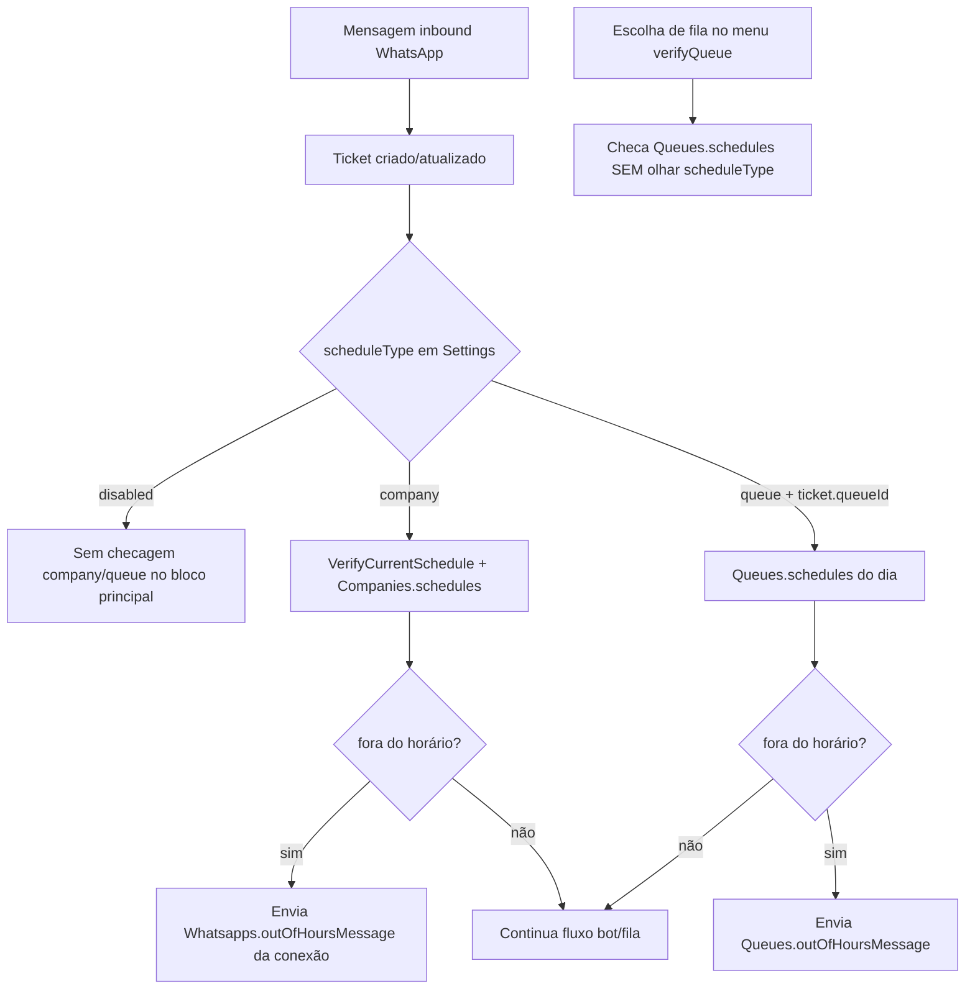

# Diagnóstico — expediente (horário de atendimento)

**Escopo:** como o sistema trata expediente hoje. **Nenhum código foi alterado.**

**Data do diagnóstico:** maio/2026  
**Contexto:** preparação para implementar expediente por conexão WhatsApp (fase posterior a userRating / behavior por conexão).

---

## Atenção: dois conceitos com nome parecido

| Conceito | Onde | Significado |
|--------|------|-------------|
| **Expediente** | `Settings.key = "scheduleType"` | Horário de atendimento (empresa/fila/desligado) |
| **Agendamento de envio** | tabela `Schedules`, campo `scheduleType` | `single` / `recurring` (campanhas/mensagens programadas) |

Este documento trata **somente do expediente** (primeira linha da tabela).

---

## Visão geral (fluxo atual)



---

## 1. Onde `scheduleType` é salvo hoje

| Local | Usado? | Detalhe |
|-------|--------|---------|
| **`Settings`** (`key = "scheduleType"`, por `companyId`) | **Sim — única fonte de modo** | Criado em `CreateCompanyService` com default `"disabled"`. Alterado via `PUT /settings/scheduleType` (admin). UI: `Options.js` → `handleScheduleType`. |
| **`Company`** | Não | Empresa não tem coluna `scheduleType`. |
| **`Queue`** | Não | Fila não tem `scheduleType`. |
| **`Whatsapps`** | Não | Conexão não tem `scheduleType` hoje. |

**Conclusão:** o **modo** expediente (`disabled` / `company` / `queue`) é **global por empresa**, em `Settings`.

### Arquivos relevantes

- `backend/src/services/CompanyService/CreateCompanyService.ts` — default `scheduleType: "disabled"`
- `backend/src/database/seeds/20200904070007-create-default-settings.ts` — seed com `"queue"` para companyId 1
- `frontend/src/components/Settings/Options.js` — `handleScheduleType` → `PUT /settings/scheduleType`
- `backend/src/controllers/SettingController.ts` — update exige `profile === "admin"`

---

## 2. Valores aceitos de `scheduleType` (expediente)

### Na UI (`Options.js`)

Somente três opções no Select:

- `disabled`
- `queue`
- `company`

### No backend (runtime)

`wbotMessageListener.ts` só trata explicitamente:

- `scheduleType.value === "company"`
- `scheduleType.value === "queue"`

Qualquer outro valor (incl. `disabled` ou string inválida) **não entra** nesses blocos.

### Na API

`PUT /settings/:settingKey` **não valida** o valor — qualquer string pode ser gravada (só admin).

### Defaults

| Origem | Valor |
|--------|--------|
| Nova empresa (`CreateCompanyService`) | `"disabled"` |
| Seed legado (`20200904070007-create-default-settings`) | `"queue"` (só companyId 1) |

**Conclusão:** valores **de fato** usados: `disabled`, `company`, `queue`. Outros valores = expediente efetivamente “não company/queue” no runtime principal.

---

## 3. Onde os horários são salvos

| Armazenamento | Campo | Formato | Editado por |
|---------------|-------|---------|-------------|
| **`Companies.schedules`** | JSONB | Array por dia da semana: `weekday`, `weekdayEn`, `startTime`, `endTime` | Aba **Horários** em `/settings` (`SchedulesForm` → `PUT /companies/:id/schedules`) quando `scheduleType === "company"` |
| **`Queues.schedules`** | JSONB | Mesmo formato | **QueueModal** aba Horários → `PUT /queue/:id` com `schedules` quando `scheduleType === "queue"` |
| **`Whatsapps`** | — | **Não há** `schedules` na conexão | — |
| **`Settings`** | — | Só o **modo**, não os horários | — |

**Não confundir:** tabela `Schedules` = envios programados de mensagem, **não** expediente.

### Formato típico de um item em `schedules`

```json
{
  "weekday": "Segunda-feira",
  "weekdayEn": "monday",
  "startTime": "08:00",
  "endTime": "18:00"
}
```

### Arquivos relevantes

- `backend/src/models/Company.ts` — `schedules: []` (JSONB)
- `backend/src/models/Queue.ts` — `schedules: []` (JSONB)
- `backend/src/services/CompanyService/UpdateSchedulesService.ts`
- `backend/src/controllers/CompanyController.ts` — `PUT /companies/:id/schedules`
- `frontend/src/components/SchedulesForm/index.js`
- `frontend/src/pages/SettingsCustom/index.js` — aba Horários

---

## 4. Onde o runtime verifica dentro/fora do horário

| Componente | Papel |
|------------|--------|
| **`wbotMessageListener.ts`** | **Único lugar** da regra de expediente de atendimento |
| **`VerifyCurrentSchedule`** (`CompanyService/VerifyCurrentSchedule.ts`) | Modo **company**: SQL em `Companies.schedules` + `now()::time` no Postgres |
| **Lógica inline com `moment()`** | Modo **queue** + escolha de fila no menu: lê `Queues.schedules`, dia `moment().format("dddd").toLowerCase()` |
| **`UpdateTicketService`** | **Não** verifica expediente |
| **`QueueService`** | **Não** verifica expediente (só persiste `schedules` / `outOfHoursMessage`) |
| **`shouldBypassChatbot`** (`helpers/shouldBypassChatbot.ts`) | Horário do **chatbot** (`Company.chatbotSchedule*`) — **sistema separado** do expediente |

### Pontos no `wbotMessageListener`

1. **~3121–3210** — após criar/atualizar ticket, antes do fluxo de bot: `company` e `queue` (com `ticket.queueId`).
2. **~3648–3699** — mais adiante no fluxo, só **`queue`** se `ticket.queueId !== null`.
3. **~1606–1650** — ao **escolher fila no menu** (`verifyQueue`): checa horário da fila se `choosenQueue.options.length === 0`, **sem ler `scheduleType`**.

### SQL do modo company (`VerifyCurrentSchedule`)

- Lê `Companies.schedules` (JSONB array).
- Filtra dia atual com `to_char(current_date, 'day')` vs `weekdayEn`.
- Calcula `inActivity` com `now()::time` entre `startTime` e `endTime`.
- **Não usa** `Company.timezone`.

---

## 5. O que acontece fora do horário

| Ação | Company | Queue (blocos principais) | Queue (menu verifyQueue) |
|------|---------|---------------------------|---------------------------|
| Envia mensagem | Sim (debounce 3s) | Sim, se `outOfHoursMessage` preenchida | Sim + texto “Voltar ao Menu Principal” |
| Fecha ticket | Não | Não | Não |
| Impede criação do ticket | Não (ticket já existe) | Não | Não |
| Remove/direciona fila | Não | Não | **Sim** — `queueId: null` |
| Interrompe processamento da mensagem | Sim (`return`) | Sim (`return`) | Sim (`return`) |

### Mensagens fora de expediente

| Modo | Texto vem de |
|------|----------------|
| **company** | `Whatsapps.outOfHoursMessage` da **conexão que recebeu** (`ShowWhatsAppService(wbot.id)`) |
| **queue** | `Queues.outOfHoursMessage` da fila do ticket |
| **menu (escolha fila)** | `Queues.outOfHoursMessage` (mesmo sem `scheduleType === "queue"`) |

### Condições para disparar (resumo)

- **Company:** `scheduleType === "company"` + `VerifyCurrentSchedule` com `inActivity === false` + registro de horário do dia válido.
- **Queue:** `scheduleType === "queue"` + `ticket.queueId` + dia com `startTime`/`endTime` + `now` fora do intervalo + mensagem não vazia.
- **`disabled`:** blocos company/queue do handler principal não rodam; **menu de fila ainda pode** checar horário da fila.

---

## 6. `scheduleType = queue`

| Pergunta | Resposta |
|----------|----------|
| Usa horário da fila? | **Sim** — `Queues.schedules` da fila do ticket (`ticket.queueId`). |
| Ticket sem fila? | Blocos em ~3159 e ~3649 exigem `ticket.queueId !== null` → **nenhuma** checagem queue nesses trechos. |
| Múltiplas filas? | **Uma fila por ticket** (`ticket.queueId`). Cada fila tem seu JSON `schedules`. |
| Qual dia? | `weekdayEn` igual ao weekday em inglês (`monday`, …) via `moment().format("dddd").toLowerCase()`. |
| Múltiplos intervalos no mesmo dia? | `schedules.find(...)` — **só o primeiro** match do dia. |
| Timezone | `moment()` **sem** `company.timezone` — horário do **servidor Node**. |

### Inconsistência importante

No **menu de filas** (~1606), a checagem de horário da fila roda **mesmo com `scheduleType = disabled` ou `company`**, desde que a fila não tenha opções de chatbot (`choosenQueue.options.length === 0`).

---

## 7. `scheduleType = company`

| Pergunta | Resposta |
|----------|----------|
| Horários | `Companies.schedules` (JSONB). |
| Verificação | `VerifyCurrentSchedule(companyId)` — SQL com `now()::time` no **Postgres** (timezone da sessão DB/servidor, **não** `Company.timezone`). |
| Dentro do horário | `inActivity === true` → segue fluxo normal. |
| Fora do horário | `inActivity === false` → mensagem + `return`. |
| Sem grade no dia | Se a query não retorna linha, `!isNil(currentSchedule)` falha → **não envia** mensagem de fora de expediente. |
| Mensagem | `whatsapp.outOfHoursMessage` — **já por conexão**; horário continua **global da empresa**. |

`Company.timezone` existe e é usado em **chatbot** e agendamentos, **não** em `VerifyCurrentSchedule` nem na checagem queue com `moment()`.

---

## 8. UI que edita expediente hoje

| Superfície | O quê | Persistência |
|------------|-------|--------------|
| **`Options.js`** (card “Avaliações e expediente”) | Select **modo** (`scheduleType`) | `PUT /settings/scheduleType` — **global**; permanece fora das abas por conexão |
| **`SettingsCustom`** aba **Horários** | Grade seg–dom | `PUT /companies/:id/schedules` — só se `scheduleType === "company"` |
| **`QueueModal`** | `outOfHoursMessage` + aba **Horários** | `PUT /queue/:id` — só se `scheduleType === "queue"` |
| **`WhatsAppModal`** | Campo `outOfHoursMessage` | `PUT /whatsapp/:id` — usado no modo **company** (mensagem por conexão) |
| **Chatbot control** (`/companies/chatbot-control`) | Horário do bot | **Não é expediente** — `chatbotSchedule` na empresa |

### Comportamento da UI ao mudar modo

- `SettingsCustom`: `scheduleTypeChanged` → `setSchedulesEnabled(value === "company")` — exibe aba Horários da empresa.
- `QueueModal`: lê `GET /settings` → exibe horários/mensagem da fila só se `scheduleType === "queue"`.

### Permissões

- `PUT /settings/*` exige `profile === "admin"` no backend.
- O Select de expediente em `Options.js` **não** usa `behaviorFieldsReadOnly` (diferente de `userRating` nas abas por conexão).

---

## 9. Menor modelo seguro para expediente por conexão

### O que já é por conexão

- **`Whatsapps.outOfHoursMessage`** — mensagem modo company **já** é por WhatsApp.

### O que é global / por fila

- **Modo** `scheduleType` → `Settings`
- **Horários modo company** → `Companies.schedules`
- **Horários/mensagem modo queue** → `Queues.*`

### Proposta em fases (alinhada ao padrão userRating / behavior)

#### Fase A — Só modo por conexão (menor risco)

- Coluna nullable `Whatsapps.scheduleType` (`disabled` | `company` | `queue`).
- Helper `resolveScheduleType(whatsappId, companyId)` com fallback em `Settings.scheduleType`.
- Runtime: substituir `Setting.findOne scheduleType` por resolve usando `ticket.whatsappId` / `wbot.id`.
- UI: mover Select para abas por conexão; **manter** horários em Company/Queue como hoje.
- **Limitação consciente:** duas conexões podem ter modos diferentes, mas horários company/queue continuam compartilhados.

#### Fase B — Mensagem company já ok; documentar + UI

- Garantir edição de `outOfHoursMessage` por aba/conexão (já no `WhatsAppModal`; pode integrar ao card de settings).
- Sem migration nova se só expor na UI de behavior.

#### Fase C — Horários company por conexão (maior impacto)

- `Whatsapps.schedules` JSONB nullable + fallback `Companies.schedules`.
- Ajustar `VerifyCurrentSchedule` para aceitar `schedules` injetado ou criar `VerifyCurrentScheduleForWhatsapp`.
- Aba horários por conexão ou sub-aba condicional (`scheduleType === company` na conexão).

#### Fase D — Queue + conexão (opcional, mais complexo)

- Manter horários na fila; só `scheduleType` por conexão costuma bastar.
- “Fila X fora de expediente só na conexão Y” exigiria matriz conexão×fila — **fora do mínimo seguro**.

### Recomendação

**Começar pela Fase A** + alinhar o trecho do **menu verifyQueue** ao `resolveScheduleType` (hoje ignora `scheduleType`).

**Não** duplicar `Queues.schedules` por conexão na v1.

---

## 10. Riscos

| Risco | Impacto |
|-------|---------|
| **Tickets já abertos** | Fora do horário só afeta **próximas mensagens**; não reabre/fecha em massa. |
| **`ticket.whatsappId` null** | Resolve deve cair no `Settings` global; company usa `wbot.id` na prática. |
| **Filas com horário próprio** | Modo `queue` ignora conexão; conexão A `disabled` + B `queue` pode confundir se menu verifyQueue ainda checar fila. |
| **Conexões novas** | `scheduleType` null → fallback global; definir default explícito na criação. |
| **Fallback global** | Empresas com só Settings continuam iguais se coluna null. |
| **Timezone** | Company queue usam relógios diferentes (Postgres `now()` vs `moment()` local); por conexão sem TZ unificado piora percepção. |
| **Mensagem vazia** | Company pode enviar body vazio; queue exige mensagem preenchida. |
| **Menu vs handler** | Comportamento diferente (limpa `queueId` no menu; não limpa no bloco ~3648). |
| **Duplicidade de checagem queue** | Dois blocos (~3159 e ~3648) com lógica repetida. |
| **Mistura com chatbot schedule** | Operador pode achar que “horário do bot” = expediente. |
| **Admin vs operador** | Expediente global editável só por admin na API; UI sem lock no Select de modo. |

---

## Resumo executivo

Hoje o expediente é **híbrido**:

1. **Modo** global (`Settings.scheduleType`).
2. **Horários** em `Companies.schedules` ou `Queues.schedules`.
3. **Mensagem fora de horário (company)** já **por conexão** (`Whatsapps.outOfHoursMessage`).
4. **Runtime** concentrado em `wbotMessageListener`, com **atalho no menu de filas** que **não respeita** `scheduleType`.
5. **Timezone da empresa não é aplicado** na checagem de expediente.

Implementação mínima segura: **`scheduleType` por conexão com fallback**, reutilizar grades e mensagens existentes, corrigir inconsistência do menu, e só depois avaliar `schedules` por WhatsApp se o produto exigir horários diferentes por número.

---

## Referência rápida de endpoints

| Ação | Método | Rota |
|------|--------|------|
| Listar settings (incl. scheduleType) | GET | `/settings` |
| Alterar modo expediente | PUT | `/settings/scheduleType` |
| Horários empresa | PUT | `/companies/:id/schedules` |
| Horários + mensagem fila | PUT | `/queue/:id` |
| Mensagem fora de horário (conexão) | PUT | `/whatsapp/:id` |

---

## Mapa de arquivos (código)

| Área | Arquivo |
|------|---------|
| Runtime expediente | `backend/src/services/WbotServices/wbotMessageListener.ts` |
| Verificação company | `backend/src/services/CompanyService/VerifyCurrentSchedule.ts` |
| Modelo empresa | `backend/src/models/Company.ts` |
| Modelo fila | `backend/src/models/Queue.ts` |
| Modelo conexão | `backend/src/models/Whatsapp.ts` (`outOfHoursMessage`) |
| Settings API | `backend/src/controllers/SettingController.ts` |
| UI modo + card | `frontend/src/components/Settings/Options.js` |
| UI horários empresa | `frontend/src/pages/SettingsCustom/index.js`, `frontend/src/components/SchedulesForm/index.js` |
| UI fila | `frontend/src/components/QueueModal/index.js` |
| UI conexão | `frontend/src/components/WhatsAppModal/index.js` |
| Chatbot (não expediente) | `backend/src/helpers/shouldBypassChatbot.ts`, `PUT /companies/chatbot-control` |

---

## Próximo passo sugerido

Fase B+ (horários/mensagens por conexão) conforme necessidade de produto.

---

## Implementação Fase A (concluída)

- Migration: `backend/src/database/migrations/20260525120000-add-whatsapp-schedule-type.ts`
- Coluna `Whatsapps.scheduleType` + helper `resolveScheduleType`
- API behavior: `scheduleType` efetivo + `usesPerConnectionScheduleType`
- Runtime: `wbotMessageListener` + correção `verifyQueue` (só `queue`)
- UI: `Options.js` — expediente por aba de conexão
