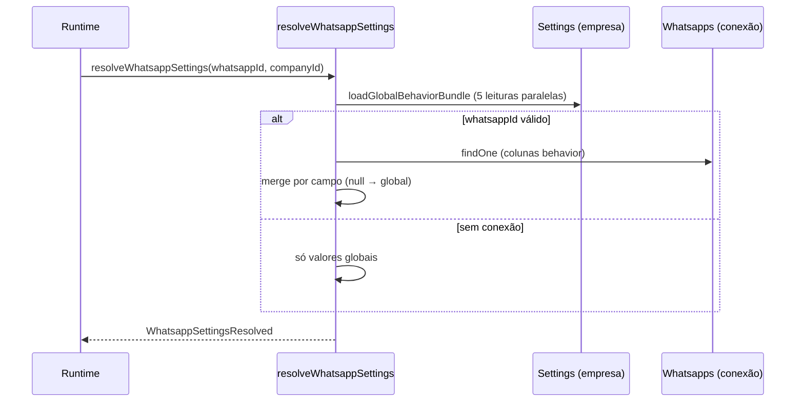

# Épico — Configuração por conexão WhatsApp (resumo final)

Documento interno de encerramento do épico. **Maio/2026.**

---

## 1. O que foi implementado

### Backend — persistência e API

- Colunas **nullable** em `Whatsapps` para comportamento por conexão, com fallback em `Settings` da empresa quando `null`.
- Endpoints dedicados (sem alterar contratos legados de `/settings`):
  - `GET /whatsapps/settings-behavior` — lista todas as conexões com valores **efetivos**, flags `usesPerConnection*` e `columnValues` (bruto das colunas).
  - `GET /whatsapps/:whatsappId/settings-behavior` — detalhe de uma conexão.
  - `PUT /whatsapps/:whatsappId/settings-behavior` — atualização parcial por conexão.
  - `PUT /whatsapps/settings-behavior/bulk` — atualização em lote.
- Validação centralizada em `buildWhatsappBehaviorPatch.ts` + `assertBehaviorSettingsPayload` (rejeita chaves extras, `null` e valores inválidos).
- Resolução unificada em `resolveWhatsappSettings.ts`:
  - `loadGlobalBehaviorBundle` — lê o bundle global uma vez (5 chaves em `Settings`).
  - Merge campo a campo: coluna da conexão → fallback global.
- Resolvers legados mantidos (`resolveWhatsappBehavior`, `resolveWhatsappAutoMessageSettings`, `resolveChatBotType`, `resolveUserRating`, `resolveScheduleType`) delegando para `resolveWhatsappSettings` — **mesmos valores**, compatibilidade total.

### Backend — runtime

| Área | Uso |
|------|-----|
| `wbotMessageListener.ts` | Grupos, expediente (`scheduleType`), menu de filas, chatbot, saudação fila única — **uma resolução por mensagem** via `loadWhatsappSettings` (cache local no escopo do handler). |
| `wbotMonitor.ts` | Chamadas rejeitadas / mensagem de recusa — `resolveWhatsappBehavior`. |
| `UpdateTicketService.ts` | Avaliação ao fechar (`userRating`) e mensagem de transferência (`sendMsgTransfTicket`). |
| `useAcceptTicket.js` (frontend) | Saudação ao aceitar ticket — lê `settings-behavior` da conexão. |

### Frontend — `/settings`

- Abas por conexão WhatsApp (admin/supervisor/suporte conforme permissões existentes).
- `Options.js` — toggles de comportamento, mensagens automáticas, chatbot, avaliação e **modo expediente** por aba.
- `SettingsCustom/index.js` — painel contextual de horários (grades empresa/fila) conforme `scheduleType` efetivo da aba ativa.
- `QueueModal` — hint de expediente em modo fila.
- i18n pt/en/es para textos de UX (alertas de herança global, modo por conexão).
- **1×** `GET /whatsapps/settings-behavior` ao abrir; troca de aba **sem** novo GET; save **1×** PUT por campo.

### Consolidação técnica e observabilidade

- `whatsappBehaviorDebug.ts` — logs com `WHATSAPP_BEHAVIOR_DEBUG=true` (resolução, patch aplicado, métricas de runtime por mensagem: `resolutions` + `totalMs`).
- Documentação técnica complementar: `docs/configuracao-por-conexao-consolidacao.md`, `docs/diagnostico-expediente-por-conexao.md`.

### Correção funcional incluída no épico

- `UpdateTicketService`: ao solicitar avaliação, `ticketTraking.userId` passa a usar `ticket.userId` (atendente do ticket), não apenas o usuário da ação de fechamento.

---

## 2. Migrations criadas (épico)

| Migration | Conteúdo |
|-----------|----------|
| `20260519120000-add-whatsapp-behavior-settings.ts` | `callHandlingMode`, `sendMessageOnCallReject`, `callRejectMessage`, `groupMessagesMode` |
| `20260520120000-add-whatsapp-auto-message-settings.ts` | `sendGreetingAccepted`, `sendMsgTransfTicket`, `sendGreetingMessageOneQueues` |
| `20260521120000-add-whatsapp-chatbot-type.ts` | `chatBotType` |
| `20260522120000-add-whatsapp-user-rating.ts` | `userRating` |
| `20260525120000-add-whatsapp-schedule-type.ts` | `scheduleType` (`disabled` \| `company` \| `queue`) |

Todas as colunas: `allowNull: true`, `defaultValue: null` (herdar global).

**Deploy:** rodar migrations antes de subir backend/frontend que dependem dessas colunas.

---

## 3. Campos agora configuráveis por conexão

Valores armazenados em colunas nullable de `Whatsapps`. A UI expõe por aba; o runtime resolve o valor **efetivo** (coluna ou fallback).

| Família | Coluna `Whatsapps` | Valores |
|---------|-------------------|---------|
| **Chamadas** | `callHandlingMode` | `accept` / `reject` |
| | `sendMessageOnCallReject` | boolean |
| | `callRejectMessage` | texto |
| **Grupos** | `groupMessagesMode` | `ignore` / `receive` |
| **Mensagens automáticas** | `sendGreetingAccepted` | `enabled` / `disabled` |
| | `sendMsgTransfTicket` | `enabled` / `disabled` |
| | `sendGreetingMessageOneQueues` | `enabled` / `disabled` |
| **Chatbot** | `chatBotType` | `text` / `button` / `list` |
| **Avaliação** | `userRating` | `enabled` / `disabled` |
| **Modo expediente** | `scheduleType` | `disabled` / `company` / `queue` |

### Relacionados ao expediente (não são colunas “behavior”, mas usados no runtime)

| Dado | Onde | Observação |
|------|------|------------|
| Mensagem fora do horário (empresa) | `Whatsapps.outOfHoursMessage` | Por conexão (já existia) |
| Grade horária empresa | `Companies.schedules` | Compartilhada |
| Grade horária fila | `Queues.schedules` | Por fila |
| Mensagem fora do horário (fila) | `Queues.outOfHoursMessage` | Por fila |

---

## 4. O que continua global (por empresa)

### Fallback em `Settings` (chave → uso)

| Chave `Settings` | Campo efetivo quando coluna WhatsApp = `null` |
|------------------|-----------------------------------------------|
| `call` | `callHandlingMode` (`enabled`→accept, `disabled`→reject) |
| `callRejectSendMessage` | `sendMessageOnCallReject` |
| `callRejectMessage` | `callRejectMessage` |
| `CheckMsgIsGroup` | `groupMessagesMode` (`enabled`→ignore) |
| `sendGreetingAccepted` | `sendGreetingAccepted` |
| `sendMsgTransfTicket` | `sendMsgTransfTicket` |
| `sendGreetingMessageOneQueues` | `sendGreetingMessageOneQueues` |
| `chatBotType` | `chatBotType` |
| `userRating` | `userRating` |
| `scheduleType` | `scheduleType` |

### Outros dados globais / fora do escopo behavior

- **Grades de horário:** `Companies.schedules`, `Queues.schedules` — não migradas para colunas por conexão.
- **Demais chaves de `/settings`:** LGPD, integrações, limites, etc. — inalteradas; continuam via `PUT /settings/:key`.
- **Mensagens da conexão** (pré-existentes): `greetingMessage`, `complationMessage`, `ratingMessage` — já eram por registro `Whatsapp`, não fazem parte deste bundle behavior.

---

## 5. Como funciona o fallback global



### Regras de merge (por campo)

- Coluna **`null`** ou ausente → herda valor de `Settings`.
- Coluna com valor **válido** do enum → usa valor da conexão (`usesPerConnection* = true` na API).
- **`callRejectMessage` vazio** na conexão → herda global; se global vazio → texto padrão por idioma da empresa (`resolveDefaultCallRejectText`).
- **`callsGroups` / `autoMessages`:** merge parcial por subcampo (cada coluna independente).

### Escrita (PUT behavior)

- Apenas valores explícitos permitidos; **não** é possível enviar `null` para “resetar” e voltar a herdar global pela API behavior (ver débito técnico).
- Config global legada continua editável via `PUT /settings/:key` (admin).

### Performance runtime (`wbotMessageListener`)

- **Antes:** até 6 resoluções completas por mensagem (≈36 round-trips: 6× bundle global + 6× `Whatsapp`).
- **Depois:** **1 resolução** por mensagem no handler principal (≈6 round-trips), com repasse do objeto para `verifyQueue` e `handleChartbot`.
- Outros serviços (`UpdateTicketService`, `wbotMonitor`) ainda resolvem sob demanda (1× por evento).

---

## 6. Como testar em homologação

### Pré-requisitos

1. Migrations aplicadas (`npm run db:migrate` ou pipeline equivalente).
2. Empresa com **≥2 conexões WhatsApp** conectadas.
3. Usuário admin (e opcional supervisor/suporte) para `/settings`.

### 6.1 API (curl ou Postman)

```bash
# Token JWT de admin
TOKEN="..."
BASE="https://homolog.seudominio.com"

# Lista behavior
curl -s -H "Authorization: Bearer $TOKEN" \
  "$BASE/whatsapps/settings-behavior" | jq '.[0] | {id, scheduleType, columnValues, usesPerConnectionScheduleType}'

# PUT por conexão (ex.: scheduleType só fila nesta conexão)
curl -s -X PUT -H "Authorization: Bearer $TOKEN" -H "Content-Type: application/json" \
  -d '{"scheduleType":"queue"}' \
  "$BASE/whatsapps/1/settings-behavior"
```

Validar:

- PUT inválido (`scheduleType: null`, chave desconhecida) → **400**.
- GET retorna `columnValues` com `null` onde herda global e flags `usesPerConnection*`.

### 6.2 UI — `/settings`

| Teste | Passos | Esperado |
|-------|--------|----------|
| Carga inicial | Abrir `/settings` como gestor | 1× GET `settings-behavior`; abas por conexão |
| Troca de aba | Alternar conexões | **0** requests extras (Network tab) |
| Herança | Conexão com `columnValues.* = null` | UI mostra valor global; alerta de herança se aplicável |
| Save por campo | Alterar chamadas / auto-msg / chatbot / rating / expediente | 1× PUT; estado local atualizado |
| Horários | Modo `company` vs `queue` na aba | Painel em `SettingsCustom` coerente com modo efetivo |

### 6.3 Runtime — smoke WhatsApp

| Cenário | Como validar |
|---------|----------------|
| **Grupos ignorados** | Conexão A: `groupMessagesMode=ignore`; enviar msg em grupo → sem ticket |
| **Chamada rejeitada** | Conexão: `reject` + mensagem custom → ligar → recusa + texto |
| **Saudação fila única** | 1 fila + `sendGreetingMessageOneQueues=enabled` → msg inbound → saudação |
| **Transferência** | `sendMsgTransfTicket=enabled` → transferir ticket → msg automática |
| **Aceitar ticket** | `sendGreetingAccepted=enabled` → aceitar → saudação |
| **Chatbot** | `chatBotType=button` vs `text` → menu de opções no formato correto |
| **Avaliação** | `userRating=enabled` → fechar ticket → fluxo de nota 1–3 |
| **Expediente company** | `scheduleType=company` + fora de `Companies.schedules` → `outOfHoursMessage` da conexão |
| **Expediente queue** | `scheduleType=queue` + fila fora do horário → `Queues.outOfHoursMessage` |
| **Conexões diferentes** | Mesma empresa, conexões A/B com behavior distinto → comportamentos independentes |

### 6.4 Debug (opcional)

```bash
WHATSAPP_BEHAVIOR_DEBUG=true
```

- Logs `[WhatsappBehavior] resolution` e `message settings runtime` com `resolutions: 1` por mensagem inbound no listener principal.

### 6.5 Regressão

- Atendimento humano (bypass chatbot, filas, integrações) inalterado.
- `PUT /settings/*` global ainda funciona para empresas que não usam abas por conexão.
- Tickets/fechamento/avaliação sem erro 500.

---

## 7. Débitos técnicos remanescentes

### 7.1 Timezone unificado

- Modo **company:** `VerifyCurrentSchedule` usa relógio do Postgres (`now()`).
- Modo **queue:** `moment()` local no Node, **sem** `Company.timezone`.
- Risco: divergência de “fora do expediente” entre modos ou entre servidores em TZ distinto.
- Referência: `docs/diagnostico-expediente-por-conexao.md`.

### 7.2 Split do `Options.js`

- ~**1705 linhas**; proposta documentada (cards: `RatingScheduleSettingsCard`, `AttendanceSettingsCard`, etc.) — **não aplicada**.
- Impacto: manutenibilidade; sem efeito funcional.

### 7.3 Resetar campo para herdar global pela UI

- PUT behavior **não aceita** `null` para limpar coluna e voltar ao fallback.
- Hoje: herança só com coluna já `null` (pós-migration ou ajuste manual no banco).
- Desejável: ação “Usar configuração global” por campo → PATCH com `null` validado.

### 7.4 Cache por request (parcialmente resolvido)

- **`wbotMessageListener`:** cache local por mensagem — **feito**.
- **`UpdateTicketService`**, **`wbotMonitor`**, **`useAcceptTicket`:** ainda 1 resolução por evento (aceitável; otimizar se profiling indicar).
- **Não** implementar cache global entre mensagens (requisito explícito do épico).

### 7.5 Outros (menores)

- **`QueueModal` / abas Horários:** parte da UI ainda consulta `scheduleType` global de `GET /settings` para exibição — pode divergir visualmente da aba por conexão até alinhar leitura.
- **Horários por conexão (`Whatsapps.schedules`):** não implementado; grades continuam em `Companies` / `Queues`.
- **Documentação viva:** atualizar `configuracao-por-conexao-consolidacao.md` seção performance (runtime já otimizado no listener).

---

## Referências rápidas

| Artefato | Caminho |
|----------|---------|
| Resolver unificado | `backend/src/helpers/resolveWhatsappSettings.ts` |
| API behavior | `backend/src/controllers/WhatsappBehaviorSettingsController.ts` |
| Patch/validação | `backend/src/helpers/buildWhatsappBehaviorPatch.ts` |
| Runtime inbound | `backend/src/services/WbotServices/wbotMessageListener.ts` |
| Hook UI | `frontend/src/hooks/useWhatsappBehaviorSettings/index.js` |
| Settings UI | `frontend/src/components/Settings/Options.js` |
| Consolidação técnica | `docs/configuracao-por-conexao-consolidacao.md` |

---

**Status do épico:** concluído. Sem migrations pendentes deste escopo. Próximos trabalhos são débitos opcionais listados na seção 7.
